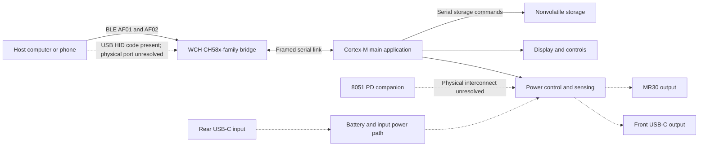

# Hardware reconstruction

Updated 2026-09-30. This is a map of hardware evidence and firmware-visible
interfaces, not a recovered schematic. No enclosure was opened and no
hardware was contacted during this analysis. Addresses here are processor
addresses. See [device facts](overview.md) for manufacturer specifications
and existing observations on the user's unit.

## Architecture

Solid lines describe software-visible relationships. Dashed lines include
manufacturer claims or untraced physical connections. The diagram does
not establish a shared ground, isolation, pass-transistor topology or
which controller handles each USB-C connector.

For bus transactions and component candidates, see [hardware-buses.md](buses.md).
For display, touch, ADC/DAC and timer outputs, see
[hardware-ui-and-analog.md](ui-and-analog.md).

## Processor identities

| Component | Confirmed in code | Inferred or unresolved |
|---|---|---|
| Main | Thumb-2, FPU, BASEPRI critical sections; application at `0x10000`; initialized RAM starts `0x1FFE0000`; initial SP `0x2003F618` | HDSC HC32 family is plausible. Exact part/package unknown |
| BLE/USB | RV32 code with compressed instructions; WCH library version string; GATT and HID drivers; application at `0x1000` | CH58x family strongly supported; exact variant unconfirmed |
| PD | 8051 instructions, startup, PD/EPR/PPS/AVS strings and state machines; application at `0x1000` | `P829` is a program string, not a proven chip marking; controller model and board placement unknown |

The exact main MCU must fit all register addresses and the RAM map. The
HC32F460 vendor header identifies `0x40054000` as CMU and `0x40010400` as
EFM. Its RAM capacity and some serial-peripheral addresses do not fit this
image. HC32F4A0 and HC32F467 have a different CMU base (`0x4004C400`).
USB VID `0x28E9` belongs to a descriptor in the WCH companion code and
cannot identify the main chip. [Vendor references](../firmware/v51/canonical/sources.md).

## Serial nonvolatile storage

Confirmed in code and checked through original ARM execution with bus
functions substituted:

| Function | Operation | Bytes sent |
|---|---|---|
| `0x1BEF8` | Read | `03`, 24-bit address, then receive data |
| `0x1BF9C` | Addressed command and optional data | command, address high/middle/low, optional bytes |
| `0x1BF3A` | Write in chunks up to 256 bytes | `06`, then `02` + address + data, wait, `04` |
| `0x1BDF6` | Erase operation | `06`, wait, `20` + address, wait, `04` |
| `0x1BDC6` | Larger erase operation | `06`, wait, `D8` + address, wait, `04` |
| `0x1F3CC` | Poll ready, bounded loop | `05`, read status, test bit 0 |

This is consistent with an SPI NOR command set, an **inference**. The bus
and command formatting are confirmed; manufacturer, capacity, sector
sizes, timing and electrical wiring have not been established. The write
routine accepts an end offset up to `0x800000`, but that software guard
does not prove an installed 8 MB chip. It splits at 256-byte lengths,
without correcting an initially unaligned address to a page boundary.
Current reviewed callers use aligned records; arbitrary writes would need
more analysis.

The send routine `0x12D10` accesses registers at `0x4001C800`. Before a
transaction the code calls `0x15384(2,0x20)`; afterwards it calls
`0x153E0(2,0x20)`. These write 16-bit GPIO masks at `0x4005382A` and
`0x40053828`. Interpreting them as an active-low chip select on port-index
2, bit 5 is inferred from the call sequence and register layout. Physical
pin numbers are unresolved.

### Storage offsets

| Offset | Firmware use | Evidence |
|---|---|---|
| `0x0F0000` | Erased on one `F6` failure path | `0x1F250` |
| `0x100000` through `0x130000` | Four erase starts for update subcommand 5 | `0x116A8` |
| `0x160000` | PD profiles, `0x21C` bytes | `0x1D380` |
| `0x161000` | Program table, `0xC0` bytes | `0x1D380` |
| `0x162000 + slot*0x1000` | Ten program-record areas; each read/write is `0x4B0` bytes, 100 records of 12 bytes | `0x1D380` |
| `0x1F0000` | Update metadata/log scan, 16 blocks of `0x100` | `0x12400` |

These are serial-device offsets. They are not main MCU memory addresses.
The BLE companion separately uses its own nonvolatile API at offset
`0x6F00` for five host IDs; the physical relationship of that store to
main storage is not established.

## Power-control signals and data flow

Confirmed instruction-level GPIO masks:

| Wrapper | Port index | Mask | Called from |
|---|---:|---|---|
| `0x14494` | 0 | `0x0080` | Main power-control path `0x19F18` |
| `0x144A8` | 0 | `0x0004` | Main power-control path `0x19F18` |
| `0x16C56` | 1 | `0x0040` | Power-control and discharge-like sequencing |
| `0x1F23C` | 0 | `0x0002` | Power-control path and PD-related state |

For each wrapper, argument zero reaches `0x15384`; nonzero reaches
`0x153E0`. These helpers write base `0x4005380A` and `0x40053808` plus
`port*0x10`. The corresponding transistor, relay, enable or discharge
signal is **unresolved**. Generic names in a decompiler are insufficient
to assign a circuit function.

The C8 setters write requested voltage/current at `0x1FFFA940` and
`0x1FFFA944`. The ramp worker `0x19E68` updates working setpoints at
`0x1FFFA950` and `0x1FFFA954`. Power worker `0x19F18` reads fault flags
at `0x1FFFAA1E`, measured values at `0x1FFFA964/68`, and enable state.
It drives the GPIO wrappers and stores scaled targets at
`0x1FFE0218/21C`. Function `0x19116` computes a saturated ten-bit value
and writes registers 3 and 4 through `0x12CB0`. The address and ten-bit register packing strongly match an SC8815-compatible
power controller. Two separate buses use that interface. The complete
analog transfer function remains unknown. See [bus and component evidence](buses.md).

This establishes a path from commands to control state. It does not
establish DAC resolution, ADC calibration, loop compensation, current
shunt values, fault thresholds, output discharge time or fail-safe behavior.
The full power-worker code is retained for further review.

## Searchable hardware evidence

- [Main MMIO candidates](../firmware/v51/canonical/main-mmio-candidates.tsv),
  [BLE MMIO candidates](../firmware/v51/canonical/ble-mmio-candidates.tsv), and
  [literal address candidates](../firmware/v51/canonical/mmio-literal-candidates.tsv).
- [GPIO and bus callers](../firmware/v51/canonical/gpio-and-bus-callers.json).
- [Main instruction listing](../firmware/v51/canonical/main/listing.asm),
  [8051 listing](../firmware/v51/canonical/pd/listing.asm), and
  [BLE listing](../firmware/v51/canonical/ble/listing.asm).
- Every processor has function, call, reference and symbol indexes.

Candidate inventories are automatically extracted. A literal can be data
or an instruction encoding; a decompiler may misidentify a global. Verify
an access in its instruction context before assigning a peripheral.

## Evidence still needed for a schematic

1. Readable board photographs of both sides and all chip markings, with
   board revisions recorded.
2. Connector pinout and continuity between the three controller domains,
   storage, display/touch, current sensing and power switches.
3. Passive component values and power-path topology, including the battery
   protection and output switching circuits.
4. A dump or documented identity of the missing bootloaders, installed
   WCH library, calibration and persistent settings.
5. Controlled measurements of scaling, protection and link-loss behavior,
   using the project's approved hardware procedures.

Register-compatible part inferences and their alternatives are recorded in
[the bus map](buses.md). The [access inventory](registers.md)
tracks instructions and remaining address-resolution gaps.

Public searches in this pass did not yield an inspected schematic or
readable board marking that resolves these identities. Manufacturer
specifications and firmware evidence are retained without filling these
gaps with guessed components.
