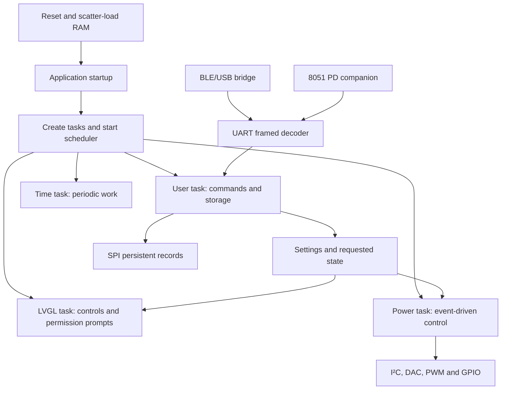

# Reading the reconstructed firmware

Start here for a human-readable view of MP305B V51. This is a researched
reconstruction, not recovered original source or a complete buildable
firmware project. Every function discovered in the three images is kept
in the [address-indexed exports](v51/canonical/README.md). Reviewed behavior
is explained separately so inferred names do not obscure original evidence.

## The main flows

The diagram summarizes traced software relationships. It does not establish
all physical interconnects. [Architecture and startup](architecture.md),
[scheduling/resources](rtos.md), [hardware buses](../device/buses.md).

## Navigation by question

| Question | Read |
|---|---|
| Which image controls which hardware? | [Hardware overview](../device/hardware.md), [three-image map](../device/buses.md#mapping-the-three-images) |
| What runs when, and what blocks? | [Tasks, priorities, mutexes and event groups](rtos.md) |
| Why are reads allowed after denial? | [Binding and permissions](permissions.md) |
| How are commands framed and routed? | [Framing and bridge routing](architecture.md#framing-and-bridge-routing) |
| What does each command do? | [Command map](command-map.md), [field-level findings](../firmware.md) |
| How are display and analog outputs driven? | [UI and analog reconstruction](../device/ui-and-analog.md) |
| Where is every decoded load/store? | [Access inventory and unresolved pointers](../device/registers.md) |
| Which claims were checked and corrected? | [Verification ledger](verification.md) |

## Compilable reconstructions

The research spike contains readable C with original entry addresses:

- [protocol.c](../../../spikes/firmware_verify/reconstructed/protocol.c):
  C6 settings validation and framing. Sequential partial updates and the
  ignored-but-validated direction field are preserved.
- [state.h](../../../spikes/firmware_verify/reconstructed/state.h): named
  offsets in the partial main-state byte view. It does not claim the
  original structure layout or invent types for unknown fields.
- [read_replies.c](../../../spikes/firmware_verify/reconstructed/read_replies.c):
  seven reply builders using tables of exact RAM byte sources. Unknown
  physical units remain unnamed.
- [workers.c](../../../spikes/firmware_verify/reconstructed/workers.c):
  deferred D9 record chunks and ten-bit power-reference register packing,
  including the observed unsigned-zero edge case.

These routines are compared with original instruction execution. The
remaining exported Ghidra C is useful for navigation but may contain
incorrect prototypes, missing arguments, overlapping functions, shared
tails, artificial variable names and warning-marked control flow. It is
not intended to compile unchanged. Follow the matching instruction listing
when a decompiled expression or argument is ambiguous.

## Important behavior to preserve

1. **State changes are not transactions.** A later invalid field can leave
   earlier C6 or C8 stores applied. A failure reply is not a rollback.
2. **Replies can be deferred.** Binding waits for UI work; D8 loads storage
   and later sends D9 record chunks. No immediate reply is not proof of
   an unsupported command.
3. **Accepted settings may be normalized later.** The settings worker
   rounds selected values upward to entries in discrete tables.
4. **Internal and wire lengths differ.** Type 6 carries a route suffix
   inside the serial bridge. AF01/AF02 notifications remove that suffix.
5. **Permission is command-specific.** Link, bind decision and remote-control
   grant are distinct; C6 is not gated like C8.
6. **A register family is not a chip identification.** Keep numeric addresses
   alongside inferred names until the board or device IDs resolve them.

## Address conventions

Main processor addresses are file offsets plus `0x10000`. PD and BLE
processor addresses are their respective extracted-image offsets plus
`0x1000`. The historical field notes in firmware.md explicitly use main
file offsets in several headings; newer subsystem documents use processor
addresses. A Thumb function pointer has bit 0 set, while its instruction
entry address is even. Never compare these numbers without normalizing
their convention.

The separate official WCH library is a comparison reference, not a fourth
ISDT image or a verified dump from the device. The main bootloader, actual
installed WCH library and per-unit calibration/settings are still missing.
