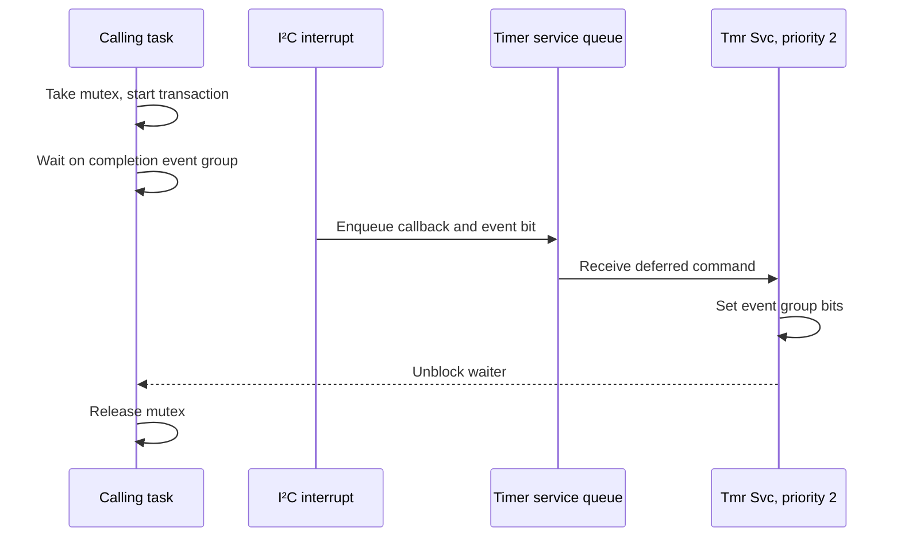

# RTOS scheduling and resources

Reconstructed from MP305B V51 on 2026-09-30. All addresses are main
processor addresses. Numeric behavior below is **confirmed in code**.
FreeRTOS API names are **inferred** from matching implementations, data
structures and call sequences. The exact FreeRTOS version is unknown.
The [offline checks](v51/canonical/verification/rtos-emulation.json) execute
62 cases against original ARM instructions with synthetic memory. They
do not measure the running device, task timing or stack high-water marks.

## Scheduling

The kernel has five priorities, 0 through 4. Higher numbers run first.
`0x65C14` selects the highest nonempty ready list and rotates its cursor.
`0x66C28` requests a switch when more than one task is ready at the current
priority. Together these establish preemption and equal-priority time
slicing. A task at priority 0 can be delayed indefinitely by continuously
ready higher-priority work.

`0x6579C` programs SysTick with `clock_hz / 1000 - 1`, clears its current
value and writes control value 7. The configured tick rate is **1 kHz**.
This assumes the clock variable at `0x2003A60C` matches the actual clock;
oscillator frequency and real elapsed time were not measured. The tick
counter at `0x1FFE000C` is 32 bits. Delayed lists swap on counter wrap.

### Tasks

`application_main` calls `0x36B48`, which creates Start_Task and starts
the scheduler. Start_Task creates the four application tasks below, then
deletes itself. The kernel creates Idle and its timer service task.

| Name | Entry | Priority | Stack words | Stack bytes | Handle address |
|---|---|---:|---:|---:|---|
| Start_Task | `0x1D7A0` | 1 | 128 | 512 | `0x1FFE0228` |
| lvgl_task | `0x53338` | 0 | 1024 | 4096 | `0x1FFE022C` |
| User_task | `0x1F208` | 3 | 512 | 2048 | `0x1FFE0230` |
| Time_task | `0x1E020` | 2 | 512 | 2048 | `0x1FFE0234` |
| Power_task | `0x1B494` | 4 | 512 | 2048 | `0x1FFE0238` |
| IDLE | `0x59AE8` | 0 | 130 | 520 | `0x1FFE002C` |
| Tmr Svc | `0x59EAC` | 2 | 260 | 1040 | `0x1FFE0044` |

Stack units are established by `0x66BA4`, which allocates `depth * 4`
bytes. `0x59B48` fills the allocation with `0xA5`, aligns the initial
stack pointer to eight bytes and clamps priorities to 4. Each task also
gets an 80-byte task control block. The seven requested stacks total
12,312 bytes before Start_Task is reclaimed, plus 560 bytes of task
control blocks and allocator overhead. This is allocated capacity, not
observed stack usage. Six tasks remain after startup deletion and cleanup.

| Task | Loop and blocking behavior |
|---|---|
| User_task | Dispatches commands, services serial transmit queues and the storage worker; relative delay of one tick |
| Time_task | Relative delay of ten ticks; ten-slot work cycle includes operations approximately every 100 ticks |
| lvgl_task | Services LVGL, normally delays one tick; one state-dependent path adds 1000 ticks when `0x1FFFAB1F` is zero |
| Power_task | Waits up to ten ticks for event bits 1 or 2, clearing matched bits; bit 1 invokes `0x19F18`, bit 2 invokes `0x1A620` |
| Tmr Svc | Receives commands and deferred callbacks from its queue; processes timer lists |

The observed delay calls are relative delays, so execution time adds to
the loop period. LVGL shares priority 0 with Idle. Time_task shares
priority 2 with Tmr Svc. No measured CPU utilization, deadline guarantee
or maximum interrupt latency follows from those priorities alone.

## Interrupts and critical sections

`0x102F4` is the PendSV context switch. It saves R4 through R11 and the
exception return value, conditionally saves S16 through S31, and uses PSP
for task stacks. The conditional floating-point save and FPCCR setup
show an FPU-aware Cortex-M port. This does not identify the exact MCU.

`0x6571C` and `0x65744` enter and leave nested critical sections using
BASEPRI `0x50`; the nesting counter is at `0x1FFE0058`. `0x66608` gives
PendSV and SysTick priority byte `0xF0`. BASEPRI masks a range of
interrupt priorities; it does not disable every interrupt. The effective
number of implemented priority bits remains dependent on the MCU.

SysTick handler `0x1D9FC` calls the tick worker and requests PendSV by
writing `0x10000000` to ICSR when a switch is needed. Scheduler suspension
uses a separate nesting count at `0x1FFE0034`, pending tick count at
`0x1FFE0018` and pending-yield flag at `0x1FFE001C`. Suspending the
scheduler and entering an interrupt-masking critical section are distinct.

## Queues, mutexes and event groups

### Concrete application resources

| Resource | Handle location | Creation and users | Behavior |
|---|---|---|---|
| Power event group | `0x1FFE0224` | Power_task, interrupt producer `0x149C8`, fallback `0x657DC` | Bits 1 and 2 select workers; bit 1 has a traced deferred interrupt producer; bit 2 producer still needs tracing |
| Hardware I²C mutex | `0x1FFF8F60` | Created lazily by `0x666A0(1)`; `0x163A4`, `0x16468` | Serializes complete bus transactions; take timeout 100 ticks; ordinary, nonrecursive mutex |
| Hardware I²C completion event group | `0x1FFF8F5C` | Created by `0x664D6`; transactions and IRQ `0x160CC` | Writes wait for bit 1, reads for bit 2, clear on exit, timeout 100 ticks |
| Timer service queue | `0x1FFE0040` | `0x599AC`, `0x670CC`, `0x59CAC` | Ten entries, each 16 bytes; carries deferred callbacks as well as software timer commands |

The I²C driver releases the mutex through `0x667A0(mutex, NULL, 0, 0)`.
More than three recorded completion failures cause reinitialization at
`0x161C0`. Its failure counter is `0x1FFF8F3A`. A successful transaction,
timeout, rejected queue insertion and recovered bus are different events;
the code must be followed at each return site before assuming recovery.

The mutex implementation records the owner at queue offset 8, raises
the owner's priority when a higher-priority task waits, and includes
disinheritance on release and timeout. The offline checks verify basic
ownership and nonrecursive behavior. They do not simulate a complete
priority-inversion scenario with actual task switching.

This extra scheduling step matters: interrupt completion alone does not
make the event bit visible. Tmr Svc must run. A priority-4 Power_task that
waits for such an event blocks until the callback executes. Mutex priority
inheritance does not itself raise the timer service task's priority.

### Queue and event implementation

Queue creation at `0x666C4` allocates `0x48 + length * item_size` bytes,
with integer-overflow checks. Message count, capacity and item size are
at offsets `0x38`, `0x3C` and `0x40`; lock counters occupy `0x44/45`.
A mutex uses a queue of length 1 and item size 0, with special ownership
handling. Event groups allocate 24 bytes and implement wait-any,
wait-all and clear-on-exit behavior.

`0x670CC` constructs a 16-byte deferred-call message containing command
`-2`, callback, parameter 1 and parameter 2, then sends it from the ISR.
The event-bit callback is `0x656B2`, which reaches `0x664F0`. Some of
these entry points share function tails and do not have separate files
in Ghidra's function index; the instruction listing is authoritative.

The software timer engine is present, including positive command values
1 through 9. No reviewed application caller has yet established an
application-created FreeRTOS software timer. LVGL timers are a separate
mechanism. No application counting semaphore, recursive mutex, stream
buffer or task notification has been identified in the reviewed callers.
This is an open caller-analysis boundary, not proof of absence.

## Heap and memory pressure

The allocator is consistent with FreeRTOS heap_4: address-ordered free
blocks, first-fit allocation and adjacent-block coalescing. Initial free
space is `0x4FF0` (20,464 bytes), from first block `0x1FFE0E90` to the
end sentinel at `0x1FFE5E80`. Eight-byte headers and eight-byte alignment
are visible. The compiled size calculation for a nonzero request is
`n + 0x10 - (n & 7)`, subject to overflow checks. In particular an
already aligned request gains 16 bytes in this implementation.

| Address | Meaning |
|---|---|
| `0x1FFE0064` | Current free heap bytes |
| `0x1FFE0068` | Minimum free bytes observed by the allocator |
| `0x1FFE006C` | Successful allocation count |
| `0x1FFE0070` | Free count |
| `0x1FFE0074` | Free-list start structure |

The checked allocations, frees, coalescing and overflow rejection execute
the original allocator. The full application's heap budget still needs
all creation paths, error paths and lifetime overlap counted. The large
LVGL buffers and other static BSS are separate from this kernel heap.

## Function names for further reconstruction

| Address | Inferred FreeRTOS role |
|---|---|
| `0x66BA4` | xTaskCreate |
| `0x59B48`, `0x598BC` | Initialize task, add to ready lists |
| `0x65C14`, `0x66C28` | Select task, increment tick |
| `0x658D4`, `0x6590C` | vTaskDelay, vTaskDelete |
| `0x65C04`, `0x66F6C` | Suspend/resume scheduler |
| `0x66C00`, `0x66C1C` | Get scheduler state, get tick count |
| `0x59F3C`, `0x65758`, `0x59BCC`, `0x59AA4` | Allocate, free, coalesce, initialize heap |
| `0x666C4`, `0x667A0`, `0x6689C`, `0x6691C` | Create queue, send, send from ISR, receive |
| `0x666A0`, `0x66A10` | Create mutex, take semaphore/mutex |
| `0x66DF4`, `0x66D64`, `0x65A6C` | Inherit priority, disinherit, timeout disinherit |
| `0x664D6`, `0x66554`, `0x664F0` | Create event group, wait, set bits |
| `0x67090`, `0x599AC`, `0x59CAC` | Create timer task, initialize timer queue, drain commands |
| `0x670CC` | Pend function call from ISR |

These names aid navigation; they do not assert source-level identity.
The comparison source is the official
[FreeRTOS V10.3.1 kernel](https://github.com/FreeRTOS/FreeRTOS-Kernel/tree/V10.3.1-kernel-only),
particularly tasks.c, queue.c, event_groups.c, heap_4.c and the RVDS
ARM_CM4F port. That tag was selected for comparison, not recovered as
the device's kernel version.

## Remaining questions

- Trace every resource creation and producer through indirect calls.
- Resolve the second power-event producer and callback-queue failure paths.
- Account for all heap allocations and maximum concurrent lifetimes.
- Check task deletion cleanup, stack overflow hooks and allocation hooks.
- Measure stack high-water marks, CPU usage, deadline jitter and bus
  recovery on hardware under an approved procedure.
- Identify the companion schedulers independently. These findings describe
  the main ARM image; they do not establish FreeRTOS in the 8051 or BLE image.
